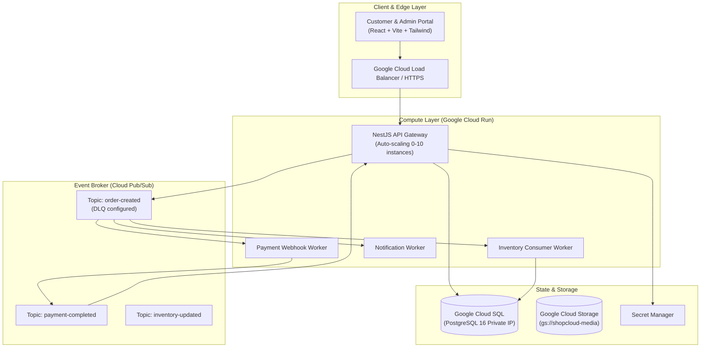

# 🛒 ShopCloud — Cloud-Native Event-Driven E-Commerce Platform on GCP

[](https://github.com/chaudaki08-beast/shopcloud/actions/workflows/ci.yml)
[](LICENSE)
[](https://cloud.google.com/)
[](https://www.terraform.io/)
[](https://www.docker.com/)

> **ShopCloud** is an enterprise-grade, event-driven e-commerce platform engineered specifically to demonstrate production cloud architecture, distributed systems resilience, and site reliability engineering on **Google Cloud Platform (GCP)**.


> **Live on Google Cloud (Phase 9):**
> * **Storefront**: [https://shopcloud-web-24903284190.asia-south1.run.app](https://shopcloud-web-24903284190.asia-south1.run.app)
> * **API Gateway**: [https://shopcloud-api-24903284190.asia-south1.run.app](https://shopcloud-api-24903284190.asia-south1.run.app)
> * **API Health & Service Status**: [https://shopcloud-api-24903284190.asia-south1.run.app/api/v1/health](https://shopcloud-api-24903284190.asia-south1.run.app/api/v1/health)
> * **Object Storage**: Bucket `gs://shopcloud-media-24903284190` (`asia-south1`, UBLA, Public Access Prevention enforced)
> * **Cloud Architecture Documentation**: [docs/gcp/cloud-storage.md](docs/gcp/cloud-storage.md) · [docs/gcp/storage-security.md](docs/gcp/storage-security.md) · [docs/gcp/cloud-sql.md](docs/gcp/cloud-sql.md) · [docs/gcp/database-production.md](docs/gcp/database-production.md)

---

## 🌟 Key Architecture & Engineering Highlights



---

## 🚦 Development Status

| Phase | Description | Status | Target Tag |
| :--- | :--- | :--- | :--- |
| **Phase 0** | Architecture & System Blueprint | ✅ **COMPLETE** | `v0.0.0-architecture` |
| **Phase 1** | Foundation (Monorepo, Web, API, Workers, Docker) | ✅ **COMPLETE** | `v0.1.0-phase1` |
| **Phase 2** | Backend & REST APIs | ✅ **COMPLETE** | `v0.2.0-phase2` |
| **Phase 3** | PostgreSQL & Migrations | ✅ **COMPLETE** | `v0.3.0-phase3` |
| **Phase 4** | Authentication & RBAC | ✅ **COMPLETE** | `v0.4.0-phase4` |
| **Phase 5** | Docker Containerization | ✅ **COMPLETE** | `v0.5.0-phase5` |
| **Phase 6** | GCP Foundation & Platform Baseline ([docs](docs/gcp/README.md)) | ✅ **COMPLETE** | `v0.6.0-phase6` |
| **Phase 7** | Cloud Run Deployment ([docs](docs/gcp/cloud-run.md)) | ✅ **COMPLETE** | `v0.7.0-phase7` |
| **Phase 8** | Cloud SQL Integration ([docs](docs/gcp/cloud-sql.md)) | ✅ **COMPLETE** | `v0.8.0-phase8` |
| **Phase 9** | Cloud Storage & Signed URLs ([docs](docs/gcp/cloud-storage.md)) | ✅ **COMPLETE** | `v0.9.0-phase9` |
| **Phase 10** | Pub/Sub Event Pipelines | 🟡 **UP NEXT** | `v1.0.0-phase10` |
| **Phase 11** | Payments & Webhooks | ⚪ NOT STARTED | `v1.1.0-phase11` |
| **Phase 12** | CI/CD with Workload Identity Federation | ⚪ NOT STARTED | `v1.2.0-phase12` |
| **Phase 13** | Terraform Infrastructure as Code | ⚪ NOT STARTED | `v1.3.0-phase13` |
| **Phase 14** | Cloud Monitoring & Alerting | ⚪ NOT STARTED | `v1.4.0-phase14` |
| **Phase 15** | Load Testing (k6) | ⚪ NOT STARTED | `v1.5.0-phase15` |
| **Phase 16** | Reliability & Disaster Recovery | ⚪ NOT STARTED | `v1.6.0-phase16` |
| **Phase 17** | GKE Workload Migration | ⚪ NOT STARTED | `v1.7.0-phase17` |
| **Phase 18** | Final Cloud Architecture Audit | ⚪ NOT STARTED | `v2.0.0` |

---

## 🏗️ Technical Stack Breakdown

| Layer | Technologies & GCP Services |
| :--- | :--- |
| **Frontend** | React 18, TypeScript, Vite, Tailwind CSS, Lucide Icons |
| **Backend API** | Node.js 22, TypeScript, NestJS, Prisma ORM |
| **Compute** | **Google Cloud Run (v2)** with min/max auto-scaling, concurrency 80, health probes |
| **Relational Database** | **Google Cloud SQL (PostgreSQL 16)** with private VPC peering & automated PITR |
| **Event Broker** | **Google Cloud Pub/Sub** with Dead-Letter Topics (DLQ) and exponential backoff retry policies |
| **Object Storage** | **Google Cloud Storage (GCS)** for product media, signed URLs, and lifecycle retention |
| **Infrastructure as Code** | **Terraform** modular configuration (VPC, IAM, Cloud SQL, Cloud Run, Pub/Sub, Alerts) |
| **DevOps & CI/CD** | **GitHub Actions** with **Workload Identity Federation** (zero long-lived service account keys) |
| **Observability** | **Google Cloud Monitoring & Logging**, custom SLO dashboard, 5xx rate alerts, P95 latency alerts |
| **Performance Testing** | **k6** load testing scripts simulating up to 1,000 concurrent virtual users |

---

## ⚡ Distributed Systems Problem-Solving

### 1. Concurrency & Overselling Prevention
When multiple customers simultaneously attempt to purchase the last available stock:
* An **ACID database transaction** (`prisma.$transaction`) checks real-time inventory and applies row-level updates.
* Atomically decrements `product.stock` and generates an `inventory_movements` audit record.
* Sets order status to `PAYMENT_PENDING` before publishing a `shopcloud.order.created` CloudEvent to Pub/Sub.

### 2. Payment Webhook Idempotency
Payment gateways can deliver webhooks multiple times due to network retries:
* The payment consumer validates unique `idempotencyKey` entries before recording transactions.
* Subsequent duplicated deliveries receive a quick idempotent `DUPLICATE_IGNORED` response without triggering duplicate orders or double charges.

### 3. Asynchronous Order Pipeline
Rather than blocking the client HTTP thread:
1. `POST /api/v1/orders` creates the order record and immediately returns `201 Created` with the order reference.
2. Background Cloud Run consumers process payment webhooks, dispatch email receipts via Cloud Storage, and confirm inventory allocation.

---

## 📁 Repository Structure

```text
shopcloud/
├── apps/
│   ├── web/                    # Customer storefront & Admin operations portal (React + Vite)
│   ├── api/                    # Core NestJS REST API Gateway
│   └── workers/                # Pub/Sub background consumers (Inventory, Payment, Notification)
├── packages/
│   ├── contracts/              # Shared TypeScript DTOs, Enums, and CloudEvent schemas
│   └── database/               # PostgreSQL Prisma schema, connection singleton, and seed script
├── infrastructure/
│   ├── terraform/              # Complete Terraform IaC modules for GCP
│   │   ├── environments/dev/   # Dev environment composition
│   │   └── modules/            # Networking, Cloud SQL, Cloud Run, Pub/Sub, IAM, Storage, Monitoring
│   ├── docker/                 # Docker Compose for local PostgreSQL 16 & Pub/Sub emulator
│   └── k6/                     # Load testing script with latency percentiles
└── .github/
    └── workflows/              # GitHub Actions CI & Workload Identity Federation CD pipelines
```

---

## 🚀 Local Development Setup

### 1. Prerequisites
* Node.js v20+ or v22+
* npm or pnpm
* (Optional) Docker for local PostgreSQL and Pub/Sub emulator

### 2. Install Dependencies
```bash
npm install
```

### 3. Database Setup, Migrations & Seeding
```bash
# Generate Prisma Client
npm run db:generate

# Apply migrations
npm run db:migrate

# Seed initial catalog, categories, dev users, and coupons
npm run db:seed

# Verify database layer integrity
npm test -w @shopcloud/database
```

### 4. Run Services
* **API Gateway**: `npm run dev:api` (Listening on `http://localhost:3000/api/v1`)
* **Web Storefront & Admin Portal**: `npm run dev:web` (Running on `http://localhost:5173`)
* **Background Workers**: `npm run dev:workers`

---

## 📊 Load Testing Benchmark (k6)

Run load simulation:
```bash
k6 run -e API_BASE_URL=http://localhost:3000/api/v1 infrastructure/k6/load-test.js
```

Benchmark targets:
* **Virtual Users (VU)**: 1,000 concurrent users
* **P95 Latency**: < 450 ms
* **P99 Latency**: < 850 ms
* **HTTP Failure Rate**: < 0.1%

---

## 🛡️ Security & Least-Privilege IAM

* **Workload Identity Federation**: GitHub Actions authenticates directly against Google Cloud via OIDC tokens; no stored JSON service account keys in repository secrets.
* **Separation of Service Accounts**:
  - `shopcloud-api`: Scoped exclusively to Cloud SQL Client, Pub/Sub Publisher, and GCS Object Admin.
  - `shopcloud-worker`: Scoped exclusively to Pub/Sub Subscriber and Cloud SQL Client.
  - `shopcloud-deployer`: Scoped to Artifact Registry and Cloud Run Developer.
* **Network Isolation**: Cloud SQL instance operates on private IP addresses accessed by Cloud Run via a Serverless VPC Access Connector.

---

## 📄 License
MIT &copy; 2026 Ganesh Patil. Engineered for GCP Cloud Architecture & DevOps Portfolio.
