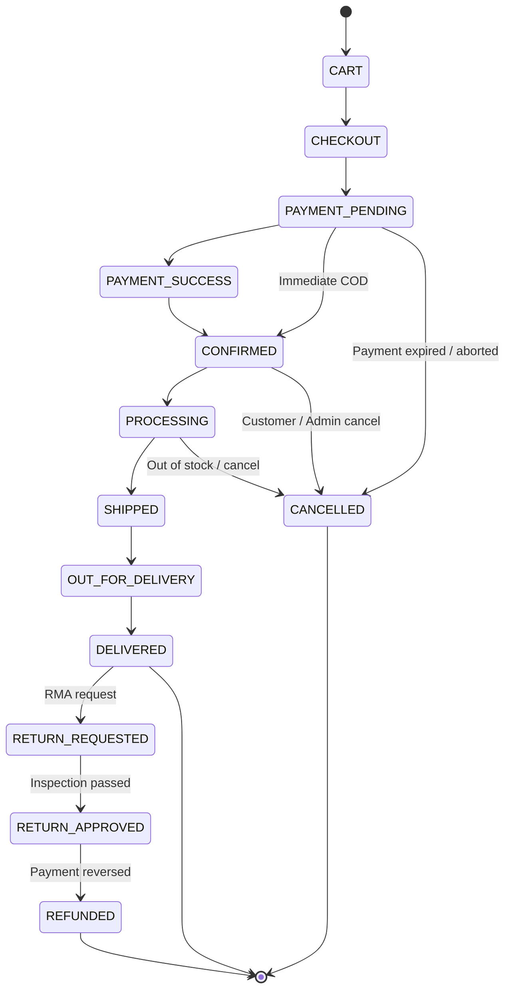

# 🔄 Order State Machine Architecture

ShopCloud enforces strict business-lifecycle order transitions through a dedicated `OrderStateMachine` component located at `apps/api/src/modules/orders/order-state-machine.ts`.

State logic is decoupled from controllers, guaranteeing that invalid transitions are rejected deterministically across all channels (API endpoints, admin mutations, payment webhooks, or background worker events).

---

## 📈 State Lifecycle Diagram



---

## 🚫 Rejection Behavior

Any transition outside the allowed lifecycle is rejected with **HTTP 409 Conflict**:

```json
{
  "success": false,
  "error": {
    "code": "ORDER_INVALID_STATE_TRANSITION",
    "message": "Order cannot transition from DELIVERED to PROCESSING"
  },
  "timestamp": "2026-10-03T08:24:42.163Z"
}
```

### Examples of Rejected Transitions
* `DELIVERED` $\to$ `CART` ❌ (Attempted replay of completed order)
* `DELIVERED` $\to$ `PROCESSING` ❌ (Cannot re-process delivered goods)
* `CART` $\to$ `SHIPPED` ❌ (Bypassing payment and stock reservation)
* `CONFIRMED` $\to$ `DELIVERED` ❌ (Bypassing physical fulfillment pipeline)
* `CANCELLED` $\to$ `PROCESSING` ❌ (Terminal state)

---

## 🔒 Atomic Stock Reservation & Release

1. **On Order Creation (`CONFIRMED` / `PAYMENT_PENDING`)**:
   - Evaluated inside an ACID transaction (`prisma.$transaction`).
   - Row-level lock verifies `product.stock >= item.quantity`.
   - Stock is decremented and an `ORDER_RESERVED` `InventoryMovement` entry is logged.

2. **On Cancellation (`CANCELLED`)**:
   - Stock is incremented back to `product.stock`.
   - An `ORDER_CANCELLED_RELEASE` `InventoryMovement` entry is logged.
   - Audit trail is appended with previous and target status.
