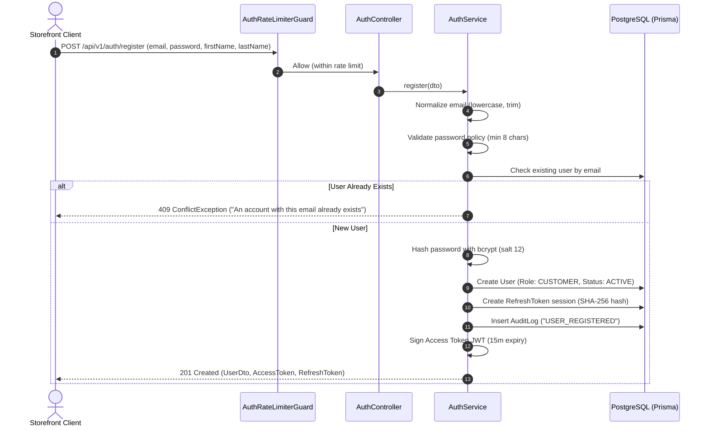
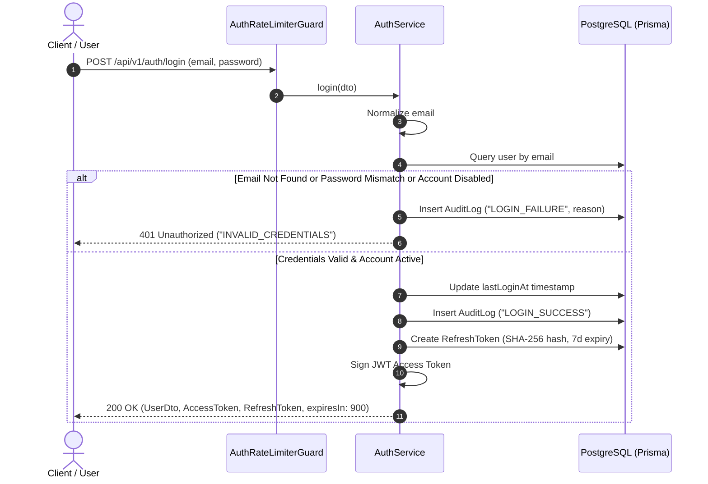
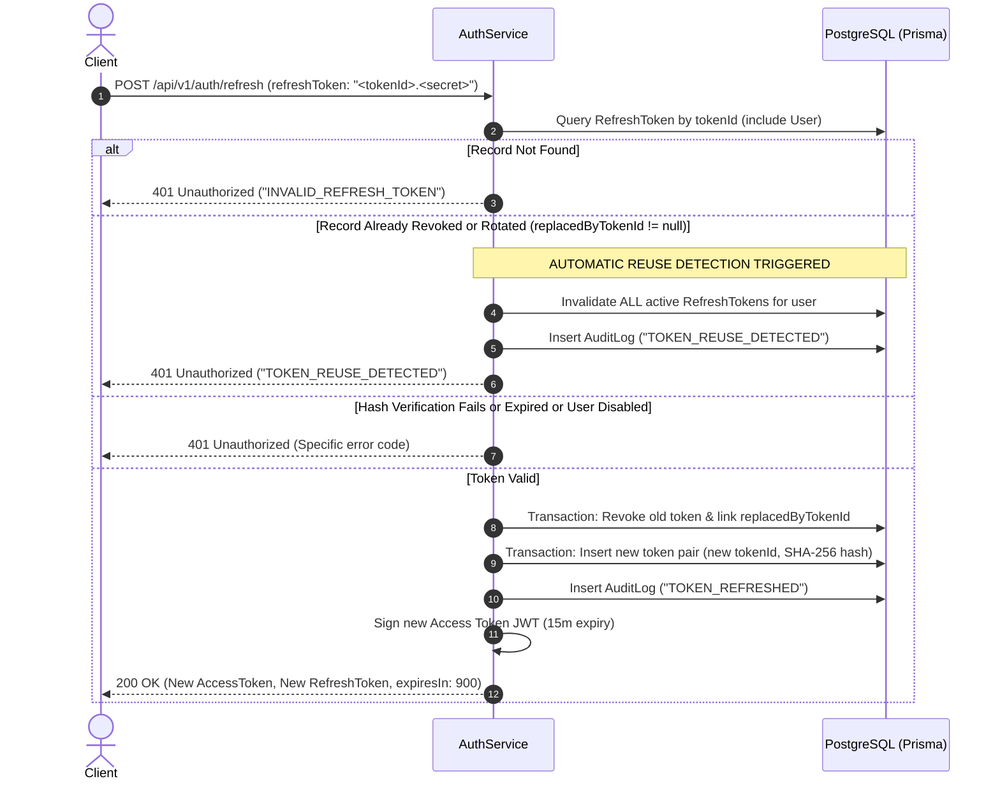

# ShopCloud — Authentication & Authorization Architecture

ShopCloud employs an enterprise-grade, cloud-native Authentication and Role-Based Access Control (RBAC) foundation designed specifically for high-throughput e-commerce operations.

---

## 1. Authentication Overview

The authentication system is completely self-contained within the ShopCloud NestJS backend and PostgreSQL database, without third-party vendor lock-in (such as Auth0, Clerk, or Firebase Auth).

### Core Components
* **Password Hashing:** `bcryptjs` with salt work factor of 12.
* **Access Tokens:** Short-lived JSON Web Tokens (JWT) with 15-minute expiration window.
* **Refresh Tokens:** Opaque, high-entropy tokens formatted as `<tokenId>.<secret>`. Token hashes (`SHA-256`) are stored in PostgreSQL; raw secrets are never persisted.
* **Token Rotation & Reuse Detection:** Immediate rotation on every refresh request. Reuse of an already-rotated or revoked token triggers immediate invalidation of all user sessions.
* **Account Status Enforcement:** Checks `AccountStatus` (`ACTIVE` vs `DISABLED`) on both credential authentication and token refresh operations.
* **Anti-Enumeration Protections:** Generic `INVALID_CREDENTIALS` error messages prevent discovery of registered emails.
* **Security Audit Trail:** Comprehensive recording in `AuditLog` of logins, failures, registrations, token refreshes, reuse attacks, and logouts.
* **Endpoint Rate Limiting:** Sensitive endpoints (`/auth/login`, `/auth/register`, `/auth/refresh`) are capped at 10 requests per minute per IP address.

---

## 2. Authentication Flows & Sequence Diagrams

### 2.1 User Registration Flow


---

### 2.2 User Login Flow & Anti-Enumeration


---

### 2.3 Refresh Token Rotation & Reuse Detection Flow


---

## 3. JWT Claims Specification

Access tokens are encoded as JSON Web Tokens signed with HS256:

```json
{
  "sub": "c1f7a0e2-4521-4f1b-9e12-892bbd8e0341",
  "email": "customer@shopcloud.dev",
  "role": "CUSTOMER",
  "jti": "9f323a6c-9be8-46b0-9bf7-28d8b671a533",
  "iat": 1759516800,
  "exp": 1759517700
}
```

* `sub`: Unique PostgreSQL UUID of the user.
* `email`: Normalized user email address.
* `role`: User role enum (`CUSTOMER`, `STORE_ADMIN`, etc.).
* `jti`: Unique token identifier to mitigate replay vulnerability.
* `exp`: Expiration time in seconds (strictly 15 minutes).

---

## 4. Resource Ownership Enforcement

Resource-level authorization ensures users can only inspect or modify their own data:
* **Cart Operations (`/api/v1/cart/**`):** Binds requests directly to `@CurrentUser().id`. A customer cannot access or tamper with another customer's shopping cart.
* **Order Management (`/api/v1/orders/**`):** `GET /orders` and `GET /orders/:id` verify that `order.userId === currentUser.id`, unless the authenticated user holds administrative permissions (`orders:update` or `SUPER_ADMIN`).
