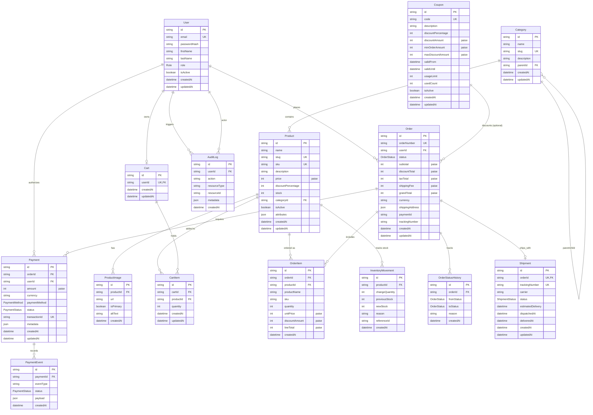

# 🗄️ ShopCloud PostgreSQL Database & Migration Architecture

ShopCloud utilizes **PostgreSQL** as its enterprise-grade relational database, managed through **Prisma ORM** with version-controlled, incremental migrations and deterministic seeding.

---

## 🏗️ Architecture & Design Principles

1. **Centralized Database Layer (`@shopcloud/database`)**:
   All database models, migrations, seeds, and the Prisma client lifecycle are maintained inside the `@shopcloud/database` monorepo package. Downstream services (`apps/api`, `apps/workers`) consume this package rather than initializing disconnected database clients.

2. **Strict Financial Precision (Zero Floating-Point)**:
   All monetary amounts (product prices, subtotal, shipping fee, tax, discounts, coupon thresholds, and grand totals) are stored as **64-bit/32-bit Integers in Paise** (1 INR = 100 paise).
   * Example: `₹1,44,900.00` is represented as integer `14490000`.

3. **Complete Auditability & State History**:
   * **Order State Transitions**: Tracked immutably in `OrderStatusHistory` with `fromStatus`, `toStatus`, timestamp, and transition rationale.
   * **Inventory Movements**: Every stock deduction, restock, and reservation records an `InventoryMovement` entry with `previousStock`, `newStock`, and reference ID.
   * **Payment Auditing**: `PaymentEvent` captures raw gateway responses and webhook payloads.
   * **Security Logs**: `AuditLog` records actor ID, resource type, action, and JSON diff metadata.

---

## 📊 Entity Relationship Diagram (ERD)

---

## 🛠️ CLI & Migration Commands

All migration and seed commands are accessible directly from the repository root:

| Command | Description |
|---|---|
| `npm run db:migrate` | Runs Prisma interactive migration (`prisma migrate dev`). Creates new migration SQL files and applies them locally. |
| `npm run db:migrate:deploy` | Applies pending migrations without schema prompts (`prisma migrate deploy`). Used in CI/CD and production pipelines. |
| `npm run db:status` | Validates migration state against the active database (`prisma migrate status`). |
| `npm run db:seed` | Runs the idempotent seed script (`packages/database/src/seed.ts`), populating catalog, users, and coupons. |
| `npm run db:reset` | Resets the database, re-applies all migrations from scratch, and runs the seed. |
| `npm run db:generate` | Regenerates the TypeScript `@prisma/client` after schema changes. |
| `npm test -w @shopcloud/database` | Executes the end-to-end database integration test suite. |

---

## 🔒 Cloud SQL & Production Readiness

While local development runs via local/Docker PostgreSQL, the database layer is designed for zero-refactoring deployment to **Google Cloud SQL for PostgreSQL**:

1. **Connection Pooling**: Configurable connection pools via `connection_limit` and pgBouncer support.
2. **Cloud SQL Auth Proxy**: Compatible with Cloud SQL Auth Proxy sidecars and private VPC connectors (`/cloudsql/PROJECT:REGION:INSTANCE`).
3. **IAM Database Authentication**: Ready for Cloud SQL IAM token authentication.
4. **Resilience & Backups**: Automated daily backups, point-in-time recovery (PITR) up to 7 days, and read-replica ready schema.
