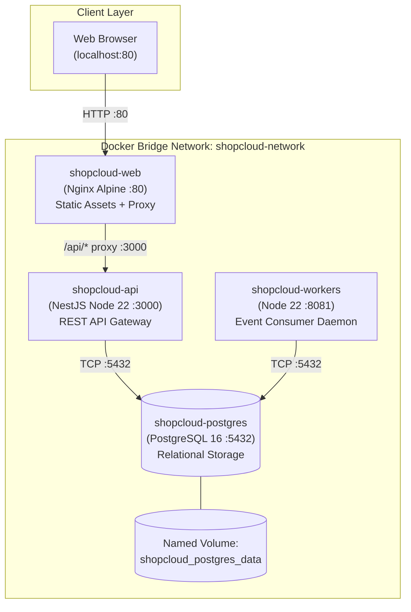
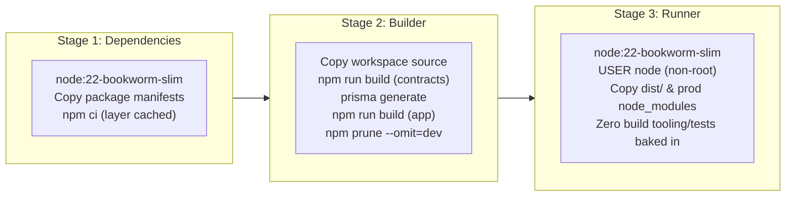

# ShopCloud — Docker & Containerization Guide

This document details the containerization architecture, multi-stage image design, Docker Compose topology, security controls, and operational workflows for **ShopCloud**.

---

## 1. Container Architecture Overview

The ShopCloud container architecture provides a clean, reproducible, and isolated local development environment that directly mirrors the future Google Cloud Platform production topology.



### Future GCP Mapping
| Local Container Service | Container Image Target | Future Google Cloud Platform Service |
| :--- | :--- | :--- |
| `shopcloud-api` | `Dockerfile.api` | **Google Cloud Run (v2)** auto-scaling service |
| `shopcloud-web` | `Dockerfile.web` | **Google Cloud Run** or **Cloud Storage + Cloud CDN** |
| `shopcloud-workers` | `Dockerfile.worker`| **Google Cloud Run Jobs / Service** |
| `shopcloud-postgres`| `postgres:16-alpine`| **Google Cloud SQL for PostgreSQL 16** |

---

## 2. Multi-Stage Dockerfile Strategy

All Node.js containers employ optimized 3-stage builds designed for maximum layer caching, minimal runtime attack surface, and predictable deterministic builds.



### 2.1 Base Image Rationale: Debian Slim vs Alpine
* **API & Workers:** Standardized on `node:22-bookworm-slim`.
  * **Rationale:** Prisma relies on a native compiled query engine (`query-engine-debian-openssl-3.0.x`). On Alpine (musl libc), dynamic linking against OpenSSL engines requires specialized compatibility packages (`libc6-compat`, `openssl`) that occasionally experience thread contention or DNS resolution delays in container networks. Debian Bookworm Slim provides 100% native glibc compatibility out of the box, eliminates musl quirks, and maintains an exceptionally small production footprint (~140 MB base image).
* **Web:** Standardized on `nginx:alpine` for serving pre-compiled static assets and reverse-proxying API traffic.

---

## 3. Service Dependency & Healthcheck Graph

To prevent race conditions on container startup, Compose enforces logical health dependencies rather than mere startup order:

```text
postgres (healthy)
    ├──> api (healthy)
    │       └──> web (healthy)
    └──> workers (healthy)
```

### Healthcheck Specifications
| Service | Mechanism | Interval | Timeout | Retries | Start Period |
| :--- | :--- | :---: | :---: | :---: | :---: |
| **Postgres** | `pg_isready -U postgres -d shopcloud` | 10s | 5s | 5 | 10s |
| **API** | Node HTTP request to `/api/v1/health/liveness` | 15s | 5s | 3 | 15s |
| **Workers** | Node HTTP request to `/health` (:8081) | 15s | 5s | 3 | 10s |
| **Web** | `wget -q -O - http://127.0.0.1:80/health` | 15s | 5s | 3 | 5s |

---

## 4. Local Developer Workflow

### 4.1 Quick Start
```bash
# 1. Copy Docker Compose environment template
cp .env.docker.example .env

# 2. Build and start the complete local container stack
docker compose up -d

# 3. Check container status and health
docker compose ps
```

### 4.2 Inspecting Logs
```bash
# Stream all logs
docker compose logs -f

# Stream specific service logs
docker compose logs -f api
docker compose logs -f workers
docker compose logs -f web
docker compose logs -f postgres
```

### 4.3 Database Migrations & Seeding in Docker
In accordance with zero-trust production principles, migrations are **never run automatically on API startup**. They are executed via on-demand Compose profile jobs:

```bash
# Deploy pending database migrations to containerized PostgreSQL
docker compose --profile tools run --rm db-migrate

# Seed development catalog and users into database
docker compose --profile tools run --rm db-seed
```

Alternatively, from the host development machine:
```bash
npm run db:migrate:deploy
npm run db:seed
```

### 4.4 Stopping & Clean Up
```bash
# Stop containers without losing PostgreSQL data (preserves named volume)
docker compose down

# Stop containers AND destroy database volume (DESTRUCTIVE RESET)
docker compose down -v
```

---

## 5. Security & Hardening Controls

1. **Non-Root Execution:** All Node.js services run as unprivileged `USER node` (UID 1000). The container process cannot modify system libraries or mount unauthorized filesystems.
2. **Zero Embedded Secrets:** No passwords, JWT secrets, or cloud keys are baked into Docker layers. All secrets are passed at runtime via environment variables or `.env`.
3. **Optimized Build Context (`.dockerignore`):** Prevents local `node_modules`, `.git`, `.env`, and temporary files from being transferred to the Docker daemon.
4. **Least Privilege Networking:** Services communicate over an internal bridge network (`shopcloud-network`). PostgreSQL does not require external port exposure in production environments.
5. **No Development Tooling in Runtime:** Compilers (TypeScript `tsc`), test runners (`jest`), and devDependencies are purged using `npm prune --omit=dev` before copying into the runtime image.

---

## 6. Troubleshooting

| Issue | Cause | Solution |
| :--- | :--- | :--- |
| `api` waits indefinitely for `postgres` | PostgreSQL healthcheck failing or starting slowly | Run `docker compose logs postgres` to inspect initialization. |
| `502 Bad Gateway` on web `/api/` | API container not yet healthy or crash-looping | Verify API health via `docker compose ps` and check `docker compose logs api`. |
| `P1001: Can't reach database server` | Database URL hostname incorrect | Inside Docker network, host must be `postgres`, not `localhost`. |
| Port 5432 conflict | Local PostgreSQL already running on host | Set `POSTGRES_PORT=5433` in `.env` or stop local PostgreSQL service. |
