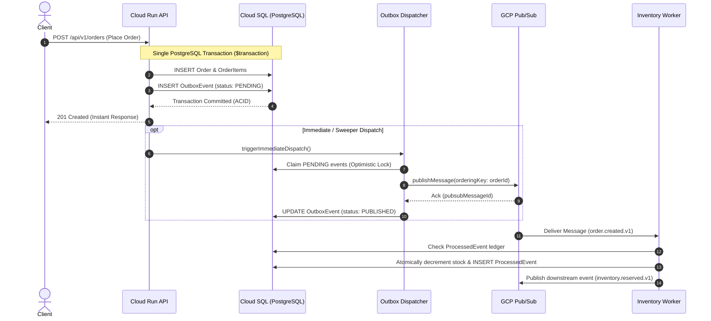

# Event-Driven Architecture & Outbox Pattern

## 1. Architectural Philosophy

In ShopCloud Phase 10, the platform transitions from synchronous in-process coupling to a decoupled, event-driven reactive architecture.

### The Dual-Write Problem
When an HTTP request creates an Order and must subsequently notify workers or external systems:
1. Updating the database and publishing to Pub/Sub in two independent operations risks **state desynchronization** if one fails.
2. If the database commits but the network fails during Pub/Sub publish, the order exists but inventory is never reserved.
3. If Pub/Sub publishes but the database rollback occurs, inventory is reserved for an order that does not exist.

### The Solution: Transactional Outbox Pattern
ShopCloud eliminates dual-write anomalies by writing domain entities and an **`OutboxEvent`** record inside the **same ACID database transaction**:



---

## 2. Canonical Event Taxonomy & Schemas

All domain events in ShopCloud follow a strict naming convention: `<aggregate>.<action>.<version>`.

```typescript
export const EVENT_TYPES = {
  ORDER_CREATED_V1: 'order.created.v1',
  ORDER_CONFIRMED_V1: 'order.confirmed.v1',
  ORDER_CANCELLED_V1: 'order.cancelled.v1',
  INVENTORY_RESERVATION_REQUESTED_V1: 'inventory.reservation.requested.v1',
  INVENTORY_RESERVED_V1: 'inventory.reserved.v1',
  INVENTORY_RELEASED_V1: 'inventory.released.v1',
  NOTIFICATION_REQUESTED_V1: 'notification.requested.v1',
} as const;
```

### Standard Event Envelope (`EventEnvelope<T>`)
Every published message wraps its payload in a standardized metadata envelope:

| Attribute | Type | Description |
| :--- | :--- | :--- |
| `eventId` | `string` | Globally unique event identifier (`evt-<timestamp>-<hash>`) |
| `eventType` | `string` | Canonical event name (e.g., `order.created.v1`) |
| `eventVersion` | `string` | Schema version (e.g., `v1`) |
| `occurredAt` | `ISO string`| Exact UTC timestamp of original domain occurrence |
| `producer` | `string` | Service identifier generating the event (`shopcloud-api`, `shopcloud-inventory-worker`) |
| `correlationId` | `string` | End-to-end trace ID traversing the entire distributed workflow |
| `causationId` | `string?` | The `eventId` of the direct antecedent event triggering this action |
| `aggregateType` | `string` | Domain aggregate root (`Order`, `Inventory`, `Notification`) |
| `aggregateId` | `string` | ID of aggregate root; matches Pub/Sub `orderingKey` |
| `payload` | `T` | Fully typed, version-stable payload |

### CloudEvents v1.0 Interoperability
ShopCloud includes an automatic bridge converting internal `EventEnvelope<T>` objects to the CNCF **CloudEvents v1.0** specification (`specversion: "1.0"`), enabling cloud-native ingestion by BigQuery, Cloud Functions, and external SaaS webhooks.

---

## 3. Durable Consumer Idempotency Pattern

Due to network partitions and distributed re-deliveries, Google Cloud Pub/Sub guarantees **at-least-once delivery**. Consumers must be strictly **idempotent**.

### `ProcessedEvent` Ledger
Workers enforce idempotency via the `ProcessedEvent` table in Cloud SQL:

```prisma
model ProcessedEvent {
  id          String   @id @default(uuid())
  eventId     String
  consumer    String
  eventType   String?
  processedAt DateTime @default(now())

  @@unique([eventId, consumer])
  @@index([consumer, processedAt])
}
```

### Execution Invariant
1. Before processing business mutations, the worker queries `ProcessedEvent` for `(eventId, consumer)`.
2. If present, the message is identified as a duplicate and immediately acknowledged with `DUPLICATE_IGNORED` without executing database modifications.
3. If absent, the business operation and the insertion of `ProcessedEvent` are executed within an **ACID transaction**.
4. If a duplicate delivery races concurrently, the PostgreSQL `unique_key` constraint violation (`P2002`) aborts the secondary transaction safely, preventing double stock deduction or duplicate charges.
