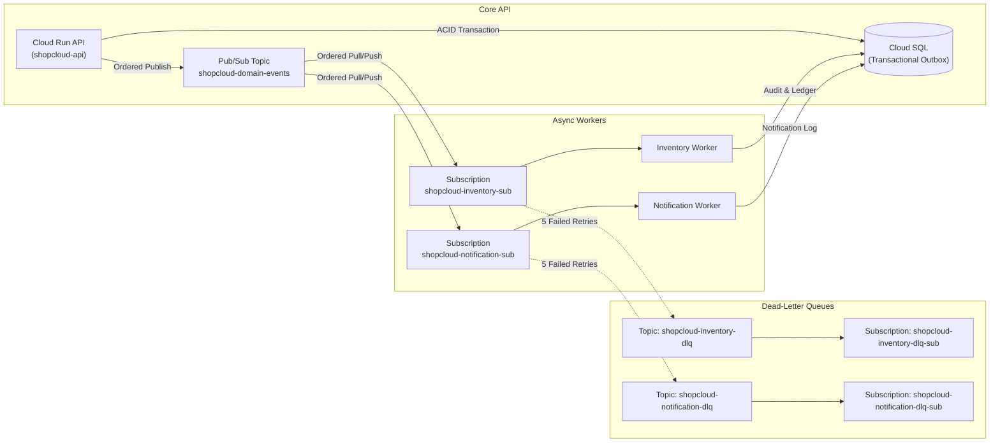

# Google Cloud Pub/Sub Architecture

## 1. Overview

ShopCloud uses **Google Cloud Pub/Sub** as its durable, highly-available event streaming backbone. In Phase 10, Pub/Sub decouples critical asynchronous domain workflows (inventory reservation, order confirmation notifications, future payment settlement) from synchronous REST request lifecycles.

---

## 2. Topics & Subscriptions Specification

### A. Topics

| Topic Name | Purpose | Message Retention | KMS / Encryption |
| :--- | :--- | :--- | :--- |
| `shopcloud-domain-events` | Primary bus for all domain events across services | Google Default (7 days) | Google-managed encryption |
| `shopcloud-inventory-dlq` | Dead-letter queue for unprocessable inventory events | 7 days | Google-managed encryption |
| `shopcloud-notification-dlq` | Dead-letter queue for failed notification messages | 7 days | Google-managed encryption |

### B. Subscriptions

| Subscription Name | Source Topic | Delivery Type | Ordering Key | Dead-Letter Topic | Max Attempts | Retry Backoff |
| :--- | :--- | :--- | :--- | :--- | :--- | :--- |
| `shopcloud-inventory-sub` | `shopcloud-domain-events` | Pull / Push | **Enabled** | `shopcloud-inventory-dlq` | 5 | 10s min, 600s max |
| `shopcloud-notification-sub`| `shopcloud-domain-events` | Pull / Push | **Enabled** | `shopcloud-notification-dlq`| 5 | 10s min, 600s max |
| `shopcloud-inventory-dlq-sub`| `shopcloud-inventory-dlq` | Pull (Operator Review) | Disabled | None | N/A | Default |
| `shopcloud-notification-dlq-sub`| `shopcloud-notification-dlq` | Pull (Operator Review) | Disabled | None | N/A | Default |

---

## 3. Message Ordering Strategy

Google Cloud Pub/Sub guarantees strictly in-order delivery of messages that share the same **ordering key**.

* **Key Assignment**: Every published event sets `orderingKey = envelope.aggregateId` (e.g. `orderId`).
* **Concurrency Guarantee**: Messages affecting different orders/aggregates are processed in parallel across worker instances without lock contention.
* **Sequential Ordering**: Consecutive lifecycle events for a specific order (e.g., `order.created.v1` → `inventory.reserved.v1` → `order.confirmed.v1`) arrive sequentially at the consumer.

---

## 4. Dead-Letter Policy & Poison Message Protection

To prevent "poison pills" (malformed payloads or persistent fatal dependencies) from blocking subscription partitions indefinitely:

1. **Max Delivery Attempts**: Set to `5`.
2. **Exponential Backoff**: Configured with a 10-second minimum backoff delay up to a 600-second maximum.
3. **Dead-Letter Routing**: After 5 failed delivery attempts, the Google Cloud Pub/Sub control plane forwards the message and its delivery metadata to the respective DLQ topic (`shopcloud-inventory-dlq` or `shopcloud-notification-dlq`).
4. **Audit & Replay**: DLQ subscriptions retain failed messages for 7 days, allowing engineers to inspect error metadata, deploy bug fixes, and replay failed messages into the domain events topic.

---

## 5. IAM & Least-Privilege Access

Pub/Sub resources enforce zero-trust identity bindings:

| Identity | Role | Scope | Justification |
| :--- | :--- | :--- | :--- |
| `service-24903284190@gcp-sa-pubsub.iam.gserviceaccount.com` | `roles/pubsub.publisher` | DLQ Topics | Allows Pub/Sub service agent to forward dead-lettered messages |
| `service-24903284190@gcp-sa-pubsub.iam.gserviceaccount.com` | `roles/pubsub.subscriber` | Worker Subscriptions | Allows Pub/Sub service agent to acknowledge dead-lettered messages |
| `shopcloud-api-runtime@...` | `roles/pubsub.publisher` | `shopcloud-domain-events` | Cloud Run API publishes transactional outbox events |
| `shopcloud-worker-runtime@...` | `roles/pubsub.subscriber` | `shopcloud-*-sub` | Workers consume domain events |
| `shopcloud-worker-runtime@...` | `roles/pubsub.publisher` | `shopcloud-domain-events` | Workers publish downstream choreography events |
